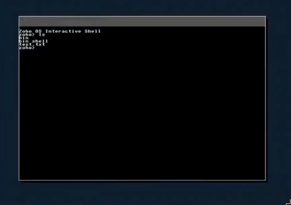

# Zoho Setu Project 2026 - Project Submission

## Baseline kernel OS 
*Create a minimal Linux kernel with core components like drivers, memory management, and basic shell.*



---

### 📝 Submission Details

| Field | Details |
| :--- | :--- |
| **Student Name** | Atharva Bodade |
| **Branch** | Information Technology |
| **Class** | Third Year |
| **College Name** | Shri Sant Gajanan Maharaj College of Engineering, Shegaon |
| **Project Type** | x86_64 Research Kernel |
| **Submission Date** | May 2026 |

---
## 🚀 Executive Summary
**Baseline kernel OS** is an educational x86_64 microkernel designed to strip away the complexity of modern operating systems while maintaining modern architectural paradigms. It provides a functional baseline for symmetric multiprocessing (SMP), advanced memory isolation, and a custom high-resolution graphics engine.

## 🎓 Educational Series (Build from Scratch)
A comprehensive video playlist explaining the development of Baseline kernel OS from line one. Every architectural decision, technical term, and code segment is explained in detail to serve as a deep-dive educational resource.

[**Watch the "Build OS from Scratch" Playlist on YouTube**](https://youtube.com/playlist?list=PLb1KzvlWYXQyj9d0_CZLnfdKmXT8Cd8uO&si=qObA4ucaPsYkwjuy)

---

## 🏗️ Technical Architecture Deep-Dive

### 1. Bootstrapping & Initialization
The transition from a powered-off state to a stable 64-bit C environment involves a multi-stage handoff:
- **Stage 1 (Real Mode)**: BIOS/GRUB handoff via Multiboot2.
- **Stage 2 (Protected Mode)**: 32-bit entry, enabling PAE (Physical Address Extension).
- **Stage 3 (Long Mode)**: Setting up identity-mapped 4-level paging and performing a far jump to the 64-bit code segment.
- **Stage 4 (Kernel Main)**: Initialization of core subsystems (PMM, VMM, ACPI, Scheduler).

### 2. Memory Management Subsystem
Baseline kernel OS implements a dual-layer memory management strategy:

| Component | Implementation Detail |
| :--- | :--- |
| **Physical (PMM)** | Hybrid bitmap and stack-based frame allocator for $O(1)$ allocation. |
| **Virtual (VMM)** | 4-level paging (PML4, PDPT, PD, PT) with recursive mapping for table access. |
| **Slab Allocator** | A custom `kmalloc` implementation using object caches to minimize fragmentation. |

### 3. SMP Scheduler & Multitasking
- **Design**: Preemptive multitasking with support for up to 16 CPU cores.
- **Core Logic**: Uses a round-robin scheduler with per-CPU runqueues and task stealing to ensure load balancing across cores.
- **Synchronization**: Implements optimized spinlocks and IRQ-safe mutexes to manage kernel-wide shared resources.

### 4. Virtual File System (VFS) & Storage
The VFS layer abstracts storage into a unified tree structure:
- **Initrd**: A disk-backed TAR filesystem used for system binaries and resources.
- **EXT2**: Native support for persistent storage on virtualized hard disks.
- **Device Nodes**: Standardized interface for hardware interactions (e.g., `/dev/tty`, `/dev/fb0`).

---

## ✨ Core Features & Subsystems

### 🔌 Hardware Abstraction Layer (HAL)
- **XHCI (USB 3.0)**: Modern high-speed host controller interface foundation.
- **Networking**: Full Intel E1000 driver integrated with a custom TCP/IP stack and DHCP client.
- **PCI/ACPI**: Automatic hardware discovery and interrupt routing via MADT tables.

### 📊 Integrated Observability
| Subsystem | Functionality |
| :--- | :--- |
| **KTrace** | A non-blocking event buffer for high-speed execution tracing and SMP debugging. |
| **KStats** | Real-time telemetry monitoring uptime, memory pressure, and task density. |
| **KLog** | Structured logging with priority filtering (DEBUG, INFO, WARN, ERROR). |

### 🖥️ User Experience (UX)
- **GUI Engine**: A custom window manager (`window.c`) featuring "Dirty Rectangle" optimization to minimize redraw overhead.
- **Interactive Shell**: A Ring-3 userland terminal with a rich command set:
  | Command | Description |
  | :--- | :--- |
  | `help` | List all available commands |
  | `monitor` | Real-time system telemetry (CPU, RAM, Tasks) |
  | `top` | Active process list and state monitor |
  | `net` | Network configuration and RX/TX stats |
  | `ls`, `cat` | File system navigation and reading |
  | `heap`, `free` | Memory allocator and PMM statistics |
  | `stress_proc` | Preemptive multitasking stress test |
  | `clear` | Terminal screen reset |

---

## 🛠️ Engineering Challenges & Resolutions

### 🛡️ Standardizing Framebuffer Pitch
**Challenge**: Skewed or black screens on certain hardware due to varying bytes-per-scanline.
**Resolution**: Refactored all graphics primitives to calculate coordinates using `fb_pitch` instead of absolute width, ensuring compatibility across diverse virtualized displays.

### 🛡️ Huge Page Corruption
**Challenge**: A critical `INT 6` fault caused by the VMM incorrectly treating 2MB Huge Pages as directory tables.
**Resolution**: Implemented 4KB page identity mapping and updated the VMM's flag propagation logic to safely handle mixed page sizes.

---

## 📂 Project Structure
```text
.
├── src/
│   ├── boot/       # Multiboot2 entry and 64-bit initialization
│   ├── kernel/     # Core executive, scheduler, and HAL
│   └── apps/       # User-space shell and GUI dashboard
├── include/        # Unified Kernel API and structures
├── docs/           # Technical assets and design diagrams
└── Makefile        # Automated build and ISO generation system
```

---

## 🚀 Getting Started

### 📦 Prerequisites & Environment Setup
The development of Baseline kernel OS requires a 64-bit environment with a C compiler, assembler, and hardware emulator.

#### **Linux (Native)**
Select the command for your specific distribution:

- **Arch Linux**:
  ```bash
  sudo pacman -S base-devel nasm qemu-desktop grub libisoburn mtools
  ```
- **Debian / Ubuntu**:
  ```bash
  sudo apt update && sudo apt install build-essential nasm qemu-system-x86 grub-pc-bin grub-common xorriso mtools
  ```
- **RHEL / Fedora**:
  ```bash
  sudo dnf groupinstall "Development Tools" && sudo dnf install nasm qemu-system-x86 grub2-tools xorriso mtools
  ```

#### **Windows**
The recommended approach for Windows is using **WSL2 (Windows Subsystem for Linux)**:
1. Install WSL2 (Ubuntu is recommended): `wsl --install`.
2. Follow the **Debian / Ubuntu** instructions above within the WSL terminal.
3. To run the OS with a GUI, ensure you have an X-Server (like GWSL) installed or use the native WSLg support in Windows 11.

---

### 🔨 Build & Run
```bash
make iso    # Generate bootable zoho_os.iso
make run    # Execute in QEMU with XHCI and USB support
```

---

## 🗺️ Future Roadmap

### 📍 Short-Term: Core I/O
- **XHCI Device Drivers**: Support for USB HID and Mass Storage.
- **FAT32 Filesystem**: Read/write support for standard media.
- **Userspace libc**: Stable C library for application development.

### 📍 Mid-Term: Performance
- **VirtIO Acceleration**: Near-native GPU and Network performance.
- **Advanced Scheduling**: Transition to MLFQ or CFS algorithms.
- **Signal Architecture**: Implementation of POSIX signal handling.

### 📍 Long-Term: Vision
- **Self-Hosting**: Porting a C compiler to recompile the kernel natively.
- **AI Runtimes**: Distributed memory support for edge AI inference.
- **Full Desktop Environment**: Modern, high-resolution GUI suite.

---

## ⚖️ License
This project is licensed under the **MIT License**. See the full text at the bottom of the technical report.

**Atharva Bodade** | 2026 Zoho Setu Submission  
[GitHub Repository](https://github.com/UnsettledAverage73/zoho-os) | [Technical Report (PDF)](documentation.pdf)
